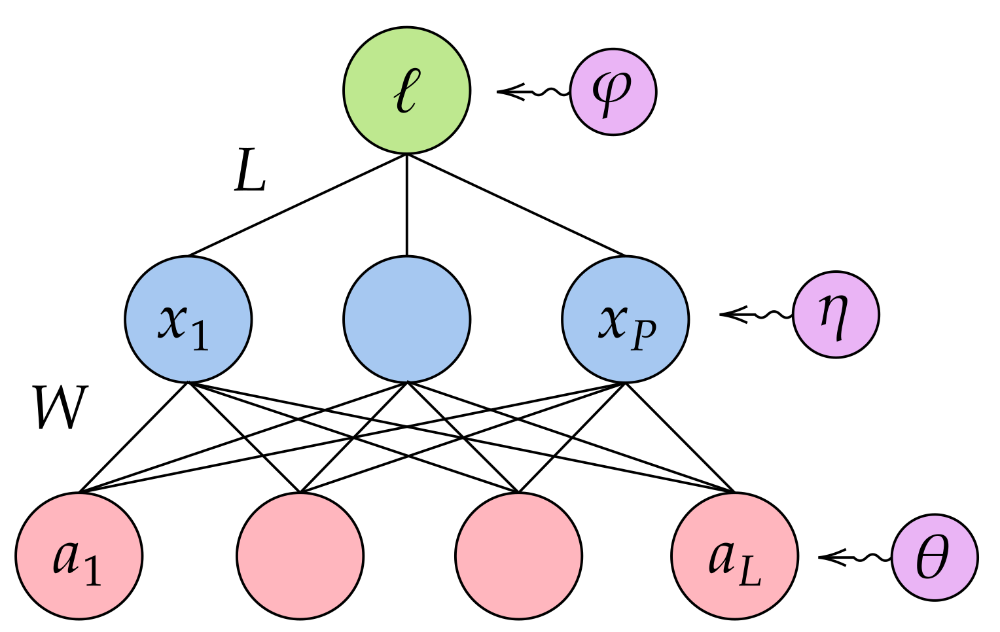

# ANNotation Assisted Direct Coupling Analisis (annaDCA)
This package contains the methods and scripts to train and sample an RBM model provided with data annotations.

<p align="center">
    
</p>

## ⬇️ Installation
### Option 1: from PyPI
```bash
python -m pip install annadca
```
### Option 2: cloning the repository
```bash
git clone https://github.com/rossetl/annaDCA.git
cd annaDCA
python -m pip install .
```

## 📘 Usage
After installation, all the main routines can be launched through the command-line interface using the command `annadca`. For now, only the `train` routine is implemented
To see all the training options do
```bash
annadca train -h
```

### ✔️ Input data format

The training routine requires three types of information: the __training sequences__, their __identifiers__ and the assocated __annotations__.

The package supports both binary variables and categorical variables (e.g. amino acid sequences).

These input data can be provided to the routine in two different ways:

- By providing a `csv` file to the `-d` argument that contains identifiers, sequences and annotations. By default, the routine will check for the columns `name`, `sequence` and `label`, but the user can specify different names using the arguments `--column_names`, `--column_sequences` and `--column_labels`.

> [!WARNING]
> The previous method only works for categorical variables. For binary variables, use the following option 

- By providing a `fasta` file (categorical variables) or a plain text file (binary variables) to the `-d` argument and an additional `csv` file to the `-a` argument containing the sequence identifiers and the annotations. Importantly, the sequence identifiers must match with those that are present in the `fasta` file.

To train the model with default arguments and a single csv file, use
```bash
annadca train -d <path_data> -o <output_directory> -l <model_tag>
```

#### Sequence data format
The model supports the following input data format:
- __Binary variables__: plain text format. Each row is one data sample, variables are separated by white spaces
- __Categorical variables__: 
    - [fasta](https://en.wikipedia.org/wiki/FASTA_format) format. Each data poin is a sequence of tokens with an header on top. The header row starts with `>`.
    - `csv` format: the file must contain one column with the aligned training sequences.
